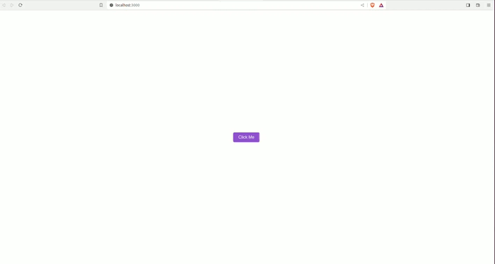

# React Styled-Components Demo

## Overview

This project is a simple React application demonstrating the use of styled-components for styling React components. It features a button that, when clicked, triggers a confetti animation and changes the background color of the page. The project is set up with TypeScript and showcases the integration of styled-components in a TypeScript-based React application.

## Key Features

- **React with TypeScript**: The project is bootstrapped with Create React App with TypeScript template.
- **Styled-Components**: We use styled-components for styling the React components, providing a more dynamic and powerful styling solution compared to traditional CSS.
- **Interactive UI**: On button click, the application triggers a confetti effect and changes the background color of the page.

## Technologies Used

- React (with TypeScript)
- Styled-Components

## Styled-Components Version

As of the latest update of this document, the project uses styled-components version 6.1.2. Please refer to the `package.json` file for the most current version used in the project.

## Running the Project Locally

To run this project on your local machine, follow these steps:

1. **Clone the Repository**
   
   Clone the project repository to your local machine using:
   ```
   git clone git@github.com:labcodes/styled-components-demo.git
   ```

2. **Navigate to the Project Directory**
   
   After cloning, move into the project directory:
   ```
   cd styled-components-demo
   ```

3. **Install Dependencies**
   
   Install the necessary dependencies by running:
   ```
   npm install
   ```

4. **Start the Development Server**
   
   Launch the development server with:
   ```
   npm start
   ```
   This will run the app in the development mode. Open [http://localhost:3000](http://localhost:3000) to view it in your browser.

  
  
5. **Explore the App**
   
   The page will reload when you make changes. You may also see any lint errors in the console.

## Contributing

Feel free to contribute to this project by submitting pull requests or suggesting features or improvements.
